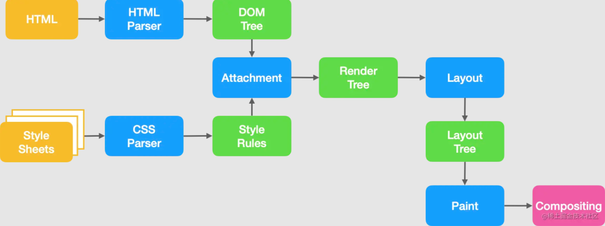

# 这些浏览器面试题，看看你能回答几个

### 1.说一说从输入URL到页面呈现发生了什么


- 1.浏览器接受URL开启网络请求线程
（涉及到：浏览器机制，线程与进程等）
- 2.开启网络线程到发出一个完整的http请求
（涉及到：DNS查询，TCP/IP请求，5层网络协议等）
- 3.从服务器接收到请求到对应后台接受到请求
（涉及到：负载均衡，安全拦截，后台内部处理等）
- 4.后台与前台的http交互
（涉及到：http头，响应码，报文结构，cookie等）
- 5.缓存问题
（涉及到：http强缓存与协商缓存，缓存头，etag,expired,cache-control等）
- 6.浏览器接受到http数据包后的解析流程
（涉及到html词法分析，解析成DOM树，解析CSS生成CSSOM树，合并生成render渲染树。然后layout布局，painting渲染，复合图层合成，GPU绘制，外链处理等）
- 7.css可视化模型
（涉及到：元素渲染规则，如：包含块，控制框，BFC，IFC等）
- 8.JS引擎解析过程
（涉及到：JS解析阶段，预处理阶段，执行阶段生成执行上下文，VO（全局对象），作用域链，回收机制等）

##### 如何回答这个问题

- 浏览器通过DNS服务器得到域名的IP地址，向这个IP地址请求得到HTML文本
- 浏览器渲染进程解析HTML文本，构建DOM树
- 解析HTML的同时，如果遇到内联样式或者样式文件，则下载并构建样式规则，如果遇到JavaScript脚本，则会下载执行脚本
- DOM树和CSSOM构建完成之后，渲染进程将两者合并成渲染树（render tree）
- 渲染进程开始对渲染树进行布局，生成布局树（layout tree）
- 渲染树对布局树进行绘制，生成绘制记录




### 4.浏览器是如何解析代码的？

解析HTML

HTML是逐行解析的，浏览器的渲染引擎会将HTML文档解析并转换成DOM节点。

- 将HTML解析成许多Tokens
- 将Tokens解析成object
- 将object组合成一个DOM树

解析CSS

浏览器会从右往左解析CSS选择器

我们知道DOM树与CSSOM树合并成render树，实际上是将CSSOM附着到DOM树上，因此需要根据选择器提供的信息对DOM树进行遍历。

```html
<style>
.nav .title span {color:blue}
</style>
​
<div class='nav'>
  <div class='title'>
    <span>南玖</span>
  </div>
  <div class="sub_title">前端</header>
</div>

```

从右至左的匹配：

- 先找到所有的最右节点 span，对于每一个 span，向上寻找节点 div.title
- 由 h3再向上寻找 div.nav 的节点
- 最后找到根元素 html 则结束这个分支的遍历。

解析JS


在浏览器中有一个js解析器的工具，专门用来解析我们的js代码。

当浏览器遇到js代码时，立马召唤“js解析器”出来工作。

解析器会找到js当中的所有变量、函数、参数等等，并且把变量赋值为未定义(undefined)。

把函数取出来成为一个函数块，然后存放到仓库当中。这件事情做完了之后才开始逐行解析代码（由上向下，由左向右），然后再去和仓库进行匹配。

### 5.DOMContentLoaded与load的区别？

- DOMContentLoaded：仅当DOM解析完成后触发，不包括样式表，图片等资源。
- Load：当页面上所有的DOM，样式表，脚本，图片等资源加载完毕事触发。

### 10.defer和async的区别？

共同点： 

- 两者都是异步去加载外部JS文件，不会阻塞DOM解析
- 如果缺少 src 属性（即内嵌脚本），该属性不应被使用，因为这种情况下它不起作用

不同点：

- Async是在外部JS加载完成后，浏览器空闲时，Load事件触发前执行，标记为async的脚本并不保证按照指定他们的先后顺序执行。
）。
- defer是在JS加载完成后，整个文档解析完成后，触发 DOMContentLoaded 事件前执行，

### 11.浏览器的垃圾回收机制

##### 哪些情况会造成内存泄漏？如何避免？

以 Vue 为例，通常有这些情况：

- 监听在 window/body 等事件没有解绑
- 绑在 EventBus 的事件没有解绑
- Vuex 的 $store，watch 了之后没有 unwatch
- 使用第三方库创建，没有调用正确的销毁函数

解决办法：beforeDestroy 中及时销毁

- 绑定了 DOM/BOM 对象中的事件 addEventListener ，removeEventListener。
- 观察者模式 $on，$off处理。
- 如果组件中使用了定时器，应销毁处理。
- 如果在 mounted/created 钩子中使用了第三方库初始化，对应的销毁。
- 使用弱引用 weakMap、weakSet。

##### 浏览器中不同类型变量的内存都是何时释放的？

引用类型

在没有引用之后，通过 V8 自动回收。

基本类型

- 如果处于闭包的情况下，要等闭包没有引用才会被 V8 回收。
- 非闭包的情况下，等待 V8 的新生代切换的时候回收。

##### 13.什么是浏览器的同源策略，以及跨域？

同源策略是浏览器的一种自我保护行为。所谓的同源指的是：协议，域名，端口均要相同

浏览器中大部分内容都是受同源策略限制的，但是以下三个标签不受限制

```html

<link href="..." />
<script src="..."></script>

```
**跨域**

跨域指的是浏览器不能执行其它域名下的脚本。它是由浏览器的同源策略限制的。

事实上，跨域请求时能够发送到服务器的，并且服务器也能过接受的请求并正常返回结果，只是结果被浏览器拦截了。

##### 跨域解决方案（列出几个常用的）

**JSONP**
它主要是利用script标签不受浏览器同源策略的限制，可以拿到从其他源传输过来的数据，需要服务端支持。

优缺点：

兼容性比较好，可用于解决主流浏览器的跨域数据访问的问题。

缺点就是仅支持get请求，具有局限性，不安全，**可能会受到XSS攻击**。

**思路：**

- 声明一个回调函数，其函数名(如show)当做参数值，要传递给跨域请求数据的服务器，函数形参为要获取目标数据(服务器返回的data)。

- 创建一个<script>标签，把那个跨域的API数据接口地址，赋值给script的src,还要在这个地址中向服务器传递该函数名（可以通过问号传参:?callback=show）。

- 服务器接收到请求后，需要进行特殊的处理：把传递进来的函数名和它需要给你的数据拼接成一个字符串,例如：传递进去的函数名是show，它准备好的数据是show('南玖')。

- 最后服务器把准备的数据通过HTTP协议返回给客户端，客户端再调用执行之前声明的回调函数（show），对返回的数据进行操作。

```js
// front
function jsonp({ url, params, callback }) {
  return new Promise((resolve, reject) => {
    window[callback] = function(data) {
      resolve(data)
      document.body.removeChild(script)
    }


    params = { ...params, callback } // wd=b&callback=show
    let arrs = []
    for (let key in params) {
      arrs.push(`${key}=${params[key]}`)
    }

    let script = document.createElement('script')
    script.src = `${url}?${arrs.join('&')}`
    document.body.appendChild(script)
  })
}
jsonp({
  url: 'http://localhost:3000/say',
  params: { wd: 'wxgongzhonghao' },
  callback: 'show'
}).then(data => {
  console.log(data)
})


// server 借助express框架
let express = require('express')
let app = express()
app.get('/say', function(req, res) {
  let { wd, callback } = req.query
  console.log(wd) // Iloveyou
  console.log(callback) // show
  res.end(`${callback}('关注前端南玖')`)
})
app.listen(3000)
```

上面这段代码相当于向http://localhost:3000/say?wd=wxgongzhonghao&callback=show这个地址请求数据，然后后台返回show('关注前端南玖')，最后会运行show()这个函数，打印出'关注前端南玖'


作者：南玖
链接：https://juejin.cn/post/7026536651899797541
来源：稀土掘金
著作权归作者所有。商业转载请联系作者获得授权，非商业转载请注明出处。


**跨域资源共享（CORS）**


CORS（Cross-Origin Resource Sharing）跨域资源共享，定义了必须在访问跨域资源时，浏览器与服务器应该如何沟通。CORS背后的基本思想是使用自定义的HTTP头部让浏览器与服务器进行沟通，从而决定请求或响应是应该成功还是失败。


服务端设置 Access-Control-Allow-Origin 就可以开启 CORS。 该属性表示哪些域名可以访问资源，如果设置通配符则表示所有网站都可以访问资源。


**Nginx反向代理**

Nginx 反向代理的原理很简单，即所有客户端的请求都必须经过nginx处理，nginx作为代理服务器再将请求转发给后端，这样就规避了浏览器的同源策略。

### 14.说说什么是XSS攻击

XSS是指黑客往页面中注入恶意脚本，从而在用户浏览页面时利用恶意脚本对用户实施攻击的一种手段。

XSS能够做什么？
- 窃取Cookie
- 监听用户行为，比如输入账号密码后之间发给黑客服务器
- 在网页中生成浮窗广告
- 修改DOM伪造登入表单

XSS实现方式

- 存储型XSS攻击
- 反射型XSS攻击
- 基于DOM的XSS攻击

如何阻止XSS攻击？

**对输入脚本进行过滤或转码**

对用户输入的信息过滤或者转码，保证用户输入的内容不能在HTML解析的时候执行。

**利用CSP**

该安全策略的实现基于一个称作 Content-Security-Policy的HTTP首部。（浏览器内容安全策略）它的核心思想就是服务器决定浏览器加载那些资源。

- 限制加载其他域下的资源文件，这样即使黑客插入了一个 JavaScript 文件，这个 JavaScript 文件也是无法被加载的；
- 禁止向第三方域提交数据，这样用户数据也不会外泄；
- 提供上报机制，能帮助我们及时发现 XSS 攻击。
- 禁止执行内联脚本和未授权的脚本；

作者：南玖
链接：https://juejin.cn/post/7026536651899797541
来源：稀土掘金
著作权归作者所有。商业转载请联系作者获得授权，非商业转载请注明出处。

**利用 HttpOnly**

### 15.说说什么是CSRF攻击？

CSRF 全称 Cross-site request forgery，中文为跨站请求伪造 ，攻击者诱导受害者进入第三方网站，在第三方网站中，向被攻击网站发送跨站请求。利用受害者在被攻击网站已经获取的注册凭证，绕过后台的用户验证，达到冒充用户对被攻击的网站执行某项操作的目的。 CSRF攻击就是黑客利用用户的登录状态，并通过第三方站点来干一些嘿嘿嘿的坏事

几种常见的攻击类型

1.GET类型的CSRF

```  ```


2.POST类型的CSRF

这种类型的CSRF利用起来通常使用的是一个自动提交的表单，如：

```html
 <form action="http://bank.example/withdraw" method=POST>
    <input type="hidden" name="account" value="xiaoming" />
    <input type="hidden" name="amount" value="10000" />
    <input type="hidden" name="for" value="hacker" />
</form>
<script> document.forms[0].submit(); </script> ```

3.链接类型的CSRF

链接类型的CSRF并不常见，比起其他两种用户打开页面就中招的情况，这种需要用户点击链接才会触发。这种类型通常是在论坛中发布的图片中嵌入恶意链接，或者以广告的形式诱导用户中招，攻击者通常会以比较夸张的词语诱骗用户点击，例如：

```html
  <a href="http://test.com/csrf/withdraw.php?amount=1000&for=hacker" taget="_blank">
  重磅消息！！
  <a/>
```

由于之前用户登录了信任的网站A，并且保存登录状态，只要用户主动访问上面的这个PHP页面，则表示攻击成功。

CSRF的特点

- 攻击一般发起在第三方网站，而不是被攻击的网站。被攻击的网站无法防止攻击发生。
- 攻击利用受害者在被攻击网站的登录凭证，冒充受害者提交操作；而不是直接窃取数据。
- 整个过程攻击者并不能获取到受害者的登录凭证，仅仅是“冒用”。
- 跨站请求可以用各种方式：图片URL、超链接、CORS、Form提交等等。部分请求方式可以直接嵌入在第三方论坛、文章中，难以进行追踪。

防护策略

黑客只能借助受害者的cookie 骗取服务器的信任，但是黑客并不能凭借拿到**cookie」**，也看不到 **「cookie」的内容。另外，对于服务器返回的结果，由于浏览器「同源策略」**的限制，黑客也无法进行解析。

这就告诉我们，我们要保护的对象是那些可以直接产生数据改变的服务，而对于读取数据的服务，则不需要进行CSRF的保护。而保护的关键，是 **「在请求中放入黑客所不能伪造的信息」**

同源检测

既然CSRF大多来自第三方网站，那么我们就直接禁止外域（或者不受信任的域名）对我们发起请求。
那么问题来了，我们如何判断请求是否来自外域呢？
在HTTP协议中，每一个异步请求都会携带两个Header，用于标记来源域名：

- Origin Header
- Referer Header

这两个Header在浏览器发起请求时，大多数情况会自动带上，并且不能由前端自定义内容。 服务器可以通过解析这两个Header中的域名，确定请求的来源域。


使用Origin Header确定来源域名

使用Referer Header确定来源域名


作者：南玖
链接：https://juejin.cn/post/7026536651899797541
来源：稀土掘金
著作权归作者所有。商业转载请联系作者获得授权，非商业转载请注明出处。

作者：南玖
链接：https://juejin.cn/post/7026536651899797541
来源：稀土掘金
著作权归作者所有。商业转载请联系作者获得授权，非商业转载请注明出处。


作者：南玖
链接：https://juejin.cn/post/7026536651899797541
来源：稀土掘金
著作权归作者所有。商业转载请联系作者获得授权，非商业转载请注明出处。
